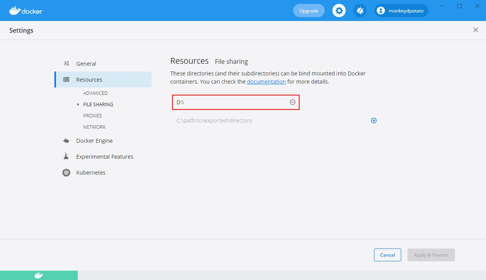
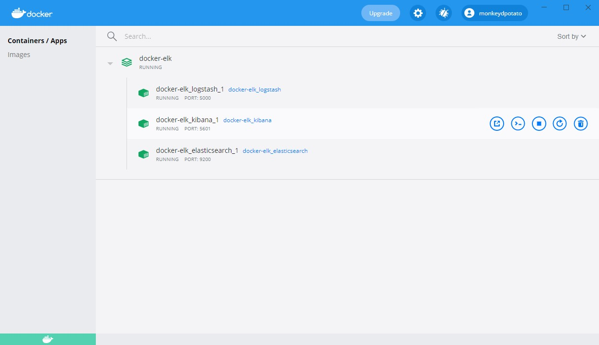

# Elastic stack (ELK) on Docker 中文版

- [Elastic stack (ELK) on Docker 中文版](#elastic-stack--elk--on-docker----)
    + [1. 主要修改](#1-----)
      - [1.1 替换下载源](#11------)
      - [1.2 修改默认语言为中文](#12----------)
    + [Windows 额外步骤](#windows-----)
    + [2. 启动项目](#2-----)
    + [3. 访问 Kibana](#3----kibana)

### 1. 主要修改

#### 1.1 替换下载源

为了解决下载缓慢的问题, 已将下载源替换为 DockerHub 源

`docker-stack.yml` 中修改了以下三处:

- `docker.elastic.co/elasticsearch/elasticsearch:${ELK_VERSION}` → `elasticsearch:${ELK_VERSION}`

- `docker.elastic.co/logstash/logstash::${ELK_VERSION}` → `logstash:${ELK_VERSION}`

- `docker.elastic.co/kibana/kibana:${ELK_VERSION}` → `kibana:${ELK_VERSION}`

**确保你已经使用了国内源**

`Docker Desktop` → `Settings` → `Docker Engine` → 修改 `registry-mirrors` → 点击 `Apply & Restart`

```shell script
  "registry-mirrors": [
    "https://registry.cn-hangzhou.aliyuncs.com",
    "https://zx0c22lh.mirror.aliyuncs.com",
    "https://mirror.ccs.tencentyun.com",
    "https://05f073ad3c0010ea0f4bc00b7105ec20.mirror.swr.myhuaweicloud.com",
    "https://registry.docker-cn.com",
    "http://hub-mirror.c.163.com",
    "http://f1361db2.m.daocloud.io",
    "https://registry.docker-cn.com"
  ]
```

#### 1.2 修改默认语言为中文

Kibana 默认中文

`kibana/config/kibana.yml` 已经增加 `i18n.locale: "zh-CN"`

### Windows 额外步骤

安装最新版的 `Docker Desktop`, 旧版没有 `FILE SHARING` 选项

添加项目所在磁盘到 `Docker Desktop` 的文件分享 (`FILE SHARING`) 中

例如, 我的项目放在 D 盘

`Settings` → `Resources` → `FILE SHARING` → 添加 `D:` → 点击 `Apply & Restart`



### 2. 启动项目

在项目根目录执行以下命令启动 `docker-elk` 容器

```shell script
docker-compose up -d
```



### 3. 访问 Kibana 

http://localhost:5601

默认账号 `elastic`

默认密码 `changeme`
